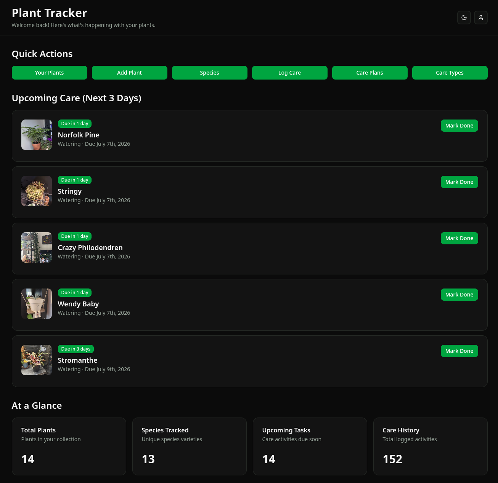

# Plant Tracker

Plant Tracker is a web app for keeping track of your houseplants. Remember to water them, log the care you give, and watch them grow over time with photos. It's built for anyone who has ever forgotten a watering (or three) during a busy season.

> _In the winter, or when you're busy in the summer, it's easy to lose track of watering your plants. Plant Tracker keeps a gentle record of the care you provide, from watering and fertilizing to repotting and your own custom care types, so nothing slips through the cracks._



## Tech Stack


- **Backend:** Flask REST API (Python 3.11), SQLAlchemy 2.0, Alembic migrations, JWT auth.
- **Frontend:** React 19 SPA, TypeScript, Vite, Tailwind CSS with shadcn/ui.
- **Storage:** PostgreSQL for data, plus photos on disk (with HEIC to JPEG conversion and thumbnails).
- **Deployment:** Docker Compose (Flask on `:5000`, Nginx-served frontend on `:3001`).

## Features

- **Plant collection:** add plants, assign species and location, attach photos, and set a cover image.
- **Care logging:** record watering, fertilizing, repotting, and more. Log a single plant or batch log several at once.
- **Care plans:** schedule recurring care on a cadence (for example weekly watering) and see what's upcoming.
- **Custom care types:** extend the built-in library (Watering, Fertilizing, and more) with your own.
- **Species reference:** a crowdsourced list of species with sunlight and water-need guidance.
- **Photos:** drag-and-drop upload, galleries with a lightbox, cover photo reordering, and automatic thumbnails.
- **Dashboard:** upcoming care at a glance, quick actions, and one-tap "mark done."
- **Dark and light theme** throughout the app.

## Project Structure

```
plant-tracker/
├── backend/            # Flask REST API (Python)
│   ├── app/
│   │   ├── api/        # Route handlers (blueprints)
│   │   ├── models/     # SQLAlchemy models
│   │   ├── services/   # Business logic
│   │   └── decorators/ # Auth decorators
│   ├── alembic/        # Database migrations
│   └── run.py          # Entry point
├── frontend/           # React SPA (TypeScript + Vite)
│   └── src/
│       ├── api/        # Axios client + endpoint modules
│       ├── pages/      # Route components
│       ├── components/ # UI + shared components
│       └── types/      # TypeScript interfaces
├── uploads/            # Photo storage (gitignored)
├── docker-compose.yml
└── .env                # Environment variables (gitignored)
```

## Getting Started

### Prerequisites

- Python 3.11+
- Node.js 18+ and npm
- PostgreSQL 15
- libmagic (system library required by `python-magic` for photo validation)

### Environment variables

Create a `.env` file at the project root. The backend loads it automatically via `python-dotenv`.

| Variable         | Required | Description                                                                             |
| ---------------- | -------- | --------------------------------------------------------------------------------------- |
| `SECRET_KEY`     | yes      | Flask session signing key                                                               |
| `JWT_SECRET_KEY` | yes      | JWT signing key. The app refuses to start without it                                    |
| `DB_NAME`        | yes      | PostgreSQL database name                                                                |
| `DB_USER`        | yes      | PostgreSQL username                                                                     |
| `DB_PASSWORD`    | yes      | PostgreSQL password                                                                     |
| `DB_HOST`        | yes      | PostgreSQL host, for example `localhost`                                                |
| `DB_PORT`        | yes      | PostgreSQL port, typically `5432`                                                       |
| `UPLOAD_FOLDER`  | no       | Path for photo storage. Defaults to `/app/uploads`                                      |
| `VITE_API_URL`   | frontend | Backend base URL, for example `http://localhost:5000`. The client appends `/api` itself |

### Backend (run from `backend/`)

```bash
python -m venv venv
source venv/bin/activate
pip install -r requirements.txt

# Apply database migrations
alembic upgrade head

# Optional: seed default care types (Watering, Fertilizing, etc.)
python seed_defaults.py

# Start the dev server at http://localhost:5000
python run.py
```

Tables are also auto-created on startup via `Base.metadata.create_all`, but prefer Alembic for any schema changes.

### Frontend (run from `frontend/`)

```bash
npm install
npm run dev      # dev server with hot reload
npm run build    # production build
npm run lint     # eslint
```

Set `VITE_API_URL` for the frontend, either in `frontend/.env` or your shell, pointing at the backend (for example `http://localhost:5000`).

### Docker

```bash
docker-compose up --build    # backend on :5000, frontend on :3001
docker-compose down
```

The PostgreSQL service is commented out in `docker-compose.yml`, so by default the app expects an external PostgreSQL instance. Uncomment the `db` service to run Postgres in Docker as well.

## API Reference

All endpoints are prefixed with `/api`. Everything except `POST /api/auth/register` and `POST /api/auth/login` requires a JWT in the `Authorization: Bearer <token>` header. All responses are JSON, and all list/create endpoints scope data to the current user.

### Auth

| Method | Path                 | Auth          | Description                                     |
| ------ | -------------------- | ------------- | ----------------------------------------------- |
| POST   | `/api/auth/register` | none          | Register and receive tokens                     |
| POST   | `/api/auth/login`    | none          | Log in and receive tokens                       |
| POST   | `/api/auth/refresh`  | refresh token | Exchange a refresh token for a new access token |

### Users

| Method | Path                  | Auth | Description                                |
| ------ | --------------------- | ---- | ------------------------------------------ |
| GET    | `/api/users`          | JWT  | Get the current user's profile             |
| PATCH  | `/api/users`          | JWT  | Update username or email                   |
| PATCH  | `/api/users/password` | JWT  | Change password (verifies the current one) |

### Plants

| Method | Path               | Auth | Description                                 |
| ------ | ------------------ | ---- | ------------------------------------------- |
| GET    | `/api/plants`      | JWT  | List the user's plants, with cover photo id |
| POST   | `/api/plants`      | JWT  | Create a plant                              |
| GET    | `/api/plants/<id>` | JWT  | Get one plant                               |
| PATCH  | `/api/plants/<id>` | JWT  | Update a plant                              |
| DELETE | `/api/plants/<id>` | JWT  | Delete a plant and its photos and care logs |

### Species

Crowdsourced reference data, editable by any authenticated user.

| Method | Path                | Auth | Description      |
| ------ | ------------------- | ---- | ---------------- |
| GET    | `/api/species`      | JWT  | List all species |
| POST   | `/api/species`      | JWT  | Create a species |
| GET    | `/api/species/<id>` | JWT  | Get one species  |
| PATCH  | `/api/species/<id>` | JWT  | Update a species |
| DELETE | `/api/species/<id>` | JWT  | Delete a species |

### Care logs and Care plans

Both live under `/api/plant-care`.

Care logs:

| Method | Path                               | Auth | Description                |
| ------ | ---------------------------------- | ---- | -------------------------- |
| GET    | `/api/plant-care/plant/<plant_id>` | JWT  | List care logs for a plant |
| POST   | `/api/plant-care`                  | JWT  | Create a care log          |
| GET    | `/api/plant-care/<care_log_id>`    | JWT  | Get one care log           |
| PATCH  | `/api/plant-care/<care_log_id>`    | JWT  | Update a care log          |
| DELETE | `/api/plant-care/<care_log_id>`    | JWT  | Delete a care log          |

Care plans:

| Method | Path                                            | Auth | Description                   |
| ------ | ----------------------------------------------- | ---- | ----------------------------- |
| GET    | `/api/plant-care/care-plans`                    | JWT  | List the user's care plans    |
| POST   | `/api/plant-care/care-plans`                    | JWT  | Create a care plan            |
| GET    | `/api/plant-care/care-plans/upcoming`           | JWT  | List upcoming care tasks      |
| GET    | `/api/plant-care/care-plans/active`             | JWT  | List active care plans        |
| GET    | `/api/plant-care/care-plans/<care_plan_id>`     | JWT  | Get one care plan             |
| PATCH  | `/api/plant-care/care-plans/<care_plan_id>`     | JWT  | Update a care plan            |
| POST   | `/api/plant-care/care-plans/<care_plan_id>/log` | JWT  | Create a care log from a plan |
| DELETE | `/api/plant-care/care-plans/<care_plan_id>`     | JWT  | Delete a care plan            |

### Care types

| Method | Path                      | Auth | Description                             |
| ------ | ------------------------- | ---- | --------------------------------------- |
| GET    | `/api/care-types/default` | JWT  | List system default care types          |
| GET    | `/api/care-types/user`    | JWT  | List the user's custom care types       |
| GET    | `/api/care-types/<id>`    | JWT  | Get one care type                       |
| POST   | `/api/care-types`         | JWT  | Create a custom care type               |
| PATCH  | `/api/care-types/<id>`    | JWT  | Update a custom care type (must own it) |
| DELETE | `/api/care-types/<id>`    | JWT  | Delete a custom care type (must own it) |

### Photos

| Method | Path                                 | Auth | Description                                            |
| ------ | ------------------------------------ | ---- | ------------------------------------------------------ |
| GET    | `/api/photos/plant/<plant_id>`       | JWT  | Aggregated gallery: plant photos then care log photos  |
| POST   | `/api/photos/plant/<plant_id>`       | JWT  | Upload to a plant (multipart, field `file` or `files`) |
| GET    | `/api/photos/care-log/<care_log_id>` | JWT  | List a care log's photos                               |
| POST   | `/api/photos/care-log/<care_log_id>` | JWT  | Upload to a care log                                   |
| PATCH  | `/api/photos/<photo_id>`             | JWT  | Update position (cover photo and reorder)              |
| DELETE | `/api/photos/<photo_id>`             | JWT  | Delete a photo, DB row plus disk files                 |
| GET    | `/api/photos/<photo_id>/file`        | JWT  | Serve the image, optional `?thumb=1`                   |

### Example: logging in

```bash
curl -X POST http://localhost:5000/api/auth/login \
  -H "Content-Type: application/json" \
  -d '{"email":"you@example.com","password":"secret"}'
```

```json
{
  "message": "User (you) logged in successfully!",
  "access_token": "eyJ...",
  "refresh_token": "eyJ...",
  "user": { "id": 1, "username": "you", "email": "you@example.com" }
}
```

Then use the access token for any protected request:

```bash
curl http://localhost:5000/api/plants \
  -H "Authorization: Bearer <access_token>"
```

## Frontend

The frontend is a React SPA built with Vite and TypeScript. Routes are defined in `src/App.tsx`, and protected routes redirect to `/login` when there is no `token` in `localStorage`.

### Routes

| Path              | Page        | Access                                      |
| ----------------- | ----------- | ------------------------------------------- |
| `/`               | redirect    | to `/dashboard` if logged in, else `/login` |
| `/login`          | Login       | public                                      |
| `/register`       | Register    | public                                      |
| `/dashboard`      | Dashboard   | protected                                   |
| `/plants`         | ViewPlants  | protected                                   |
| `/plants/add`     | AddPlant    | protected                                   |
| `/plants/:id`     | PlantDetail | protected                                   |
| `/species`        | Species     | protected                                   |
| `/care-plans`     | CarePlans   | protected                                   |
| `/care-plans/add` | AddCarePlan | protected                                   |
| `/care-types`     | CareTypes   | protected                                   |
| `/log-care`       | LogCare     | protected                                   |
| `/settings`       | Settings    | protected                                   |

### Conventions

- **HTTP client:** `src/api/axios.ts` sets `baseURL` to `${VITE_API_URL}/api`, attaches the JWT from `localStorage` on every request, and silently refreshes on a 401 using the stored refresh token. If the refresh fails it clears the tokens and redirects to `/login`.
- **API modules:** one file per domain in `src/api/` (`plants`, `species`, `careLogs`, `carePlans`, `careTypes`, `photos`, `users`, `auth`, `dashboard`), each exporting typed functions.
- **Types:** shared TypeScript interfaces live in `src/types/`.
- **UI:** shadcn/ui components in `src/components/ui/`, styled with Tailwind CSS and CSS variables. Dark mode is the default, with the theme stored under the `vite-ui-theme` key.
- **Auth images:** photos are JWT protected, so `AuthImage` fetches the file via axios and renders it from a blob URL, revoking the URL on unmount.
- **Path alias:** `@/` maps to `src/`.

## Database Migrations and Seeding

Migrations are managed with Alembic and live in `backend/alembic/versions/`. Run these from the `backend/` directory.

```bash
alembic upgrade head                       # apply all migrations
alembic revision --autogenerate -m "msg"   # create a migration from model changes
alembic downgrade -1                       # roll back the latest migration
```

Seed the system default care types once after setting up the database. The script is idempotent and skips itself if defaults already exist.

```bash
python seed_defaults.py   # Watering, Fertilizing, Repotting, Pruning, Pest Control, Misting
```

## Photo Storage

Photos are stored on disk under the `UPLOAD_FOLDER` path, not in the database. The database holds only metadata.

```
uploads/
  plants/<plant_id>/<uuid>.jpg          # original (all formats converted to JPEG)
  plants/<plant_id>/<uuid>_thumb.jpg    # 400px-wide thumbnail
  care-logs/<care_log_id>/<uuid>.jpg
  care-logs/<care_log_id>/<uuid>_thumb.jpg
```

Processing, handled by `PhotoService`:

- MIME type is sniffed from the file contents with `python-magic`, so a spoofed upload header cannot bypass validation.
- HEIC and HEIF images are converted to JPEG for browser compatibility.
- A 400px-wide thumbnail is generated with Lanczos resampling.
- Filenames are random UUIDs and are never reused.

Serving:

- Files are served through `GET /api/photos/<id>/file`, which is JWT protected and ownership checked. Pass `?thumb=1` for the thumbnail.
- The frontend renders them with `AuthImage`, which fetches via axios and renders from a blob URL.

Cleanup:

- Database cascades remove the `Photo` rows automatically when a plant or care log is deleted.
- The on-disk files are removed by `cleanup_plant_files` or `cleanup_care_log_files`.

## Contributing

Pull requests are welcome. To keep things consistent:

1. Run `npm run lint` in `frontend/` before submitting.
2. For database changes, generate an Alembic migration with `alembic revision --autogenerate -m "..."` and apply it locally with `alembic upgrade head`.
3. Keep any new API endpoints behind JWT and scoped to the current user.

## License

Released under the MIT License.
